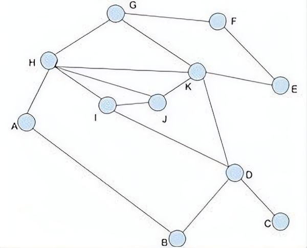
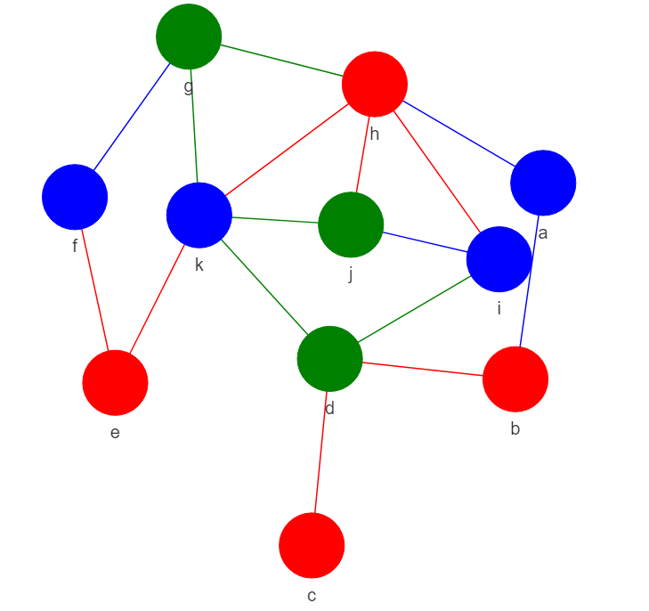

## Graph Coloring

Hiện thực thuật toán Welsh-Powell trong vấn đề tô màu cho đồ thị.

Cài đặt thư viện cần thiết
```python
pip install -r requirements.txt
```

Ví dụ với đồ thị sau:



Chuyển đồ thị thành ma trận kề lưu trong Adjacency_matrix.txt:

```scalar
0 1 0 0 0 0 0 1 0 0 0
1 0 0 1 0 0 0 0 0 0 0
0 0 0 1 0 0 0 0 0 0 0
0 1 1 0 0 0 0 0 1 0 1
0 0 0 0 0 1 0 0 0 0 1
0 0 0 0 1 0 1 0 0 0 0
0 0 0 0 0 1 0 1 0 0 1
1 0 0 0 0 0 1 0 1 1 1
0 0 0 1 0 0 0 1 0 1 0
0 0 0 0 0 0 0 1 1 0 1
0 0 0 1 1 0 1 1 0 1 0
```
Chạy chương trình
```python
python Graph_coloring.py -p file_name -l labels
```
> -p: flag bắt buộc (Đường dẫn đến file chứa ma trận kề).
> -l: flag tùy chọn (Danh sách nhãn cho các đỉnh, số lượng nhãn phải bằng số lượng đỉnh).

Chạy chương trình với ví dụ
python Graph_coloring.py -p Adjacency_matrix.txt

Thu được kết quả:



>Để đánh nhãn lại cho các đỉnh thì trong ***Graph_coloring.py*** chỉnh sửa list ***labels*** thành danh sách các nhãn tương ứng với từng đỉnh. Nếu không mặc định sẽ là các chữ cái viết thường theo thứ tự bảng chữ cái

References:
>[1] [GeeksForGeeks: Welsh-Powell Graph colouring Algorithm](https://www.geeksforgeeks.org/welsh-powell-graph-colouring-algorithm/)
